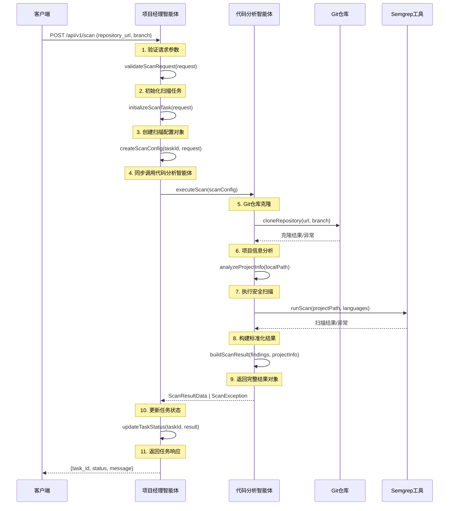

# 智能体间同步通信流程设计

## 1. 序列图



## 2. 伪代码实现

### 2.1 项目经理智能体 (ProjectManagerAgent)

```python
class ProjectManagerAgent:
    
    def __init__(self):
        self.code_analyzer = CodeAnalysisAgent()
        self.task_storage = TaskStorage()
    
    # API入口点
    def handle_scan_request(self, request_data):
        """
        处理POST /api/v1/scan请求的主入口
        """
        try:
            # 1. 验证请求参数
            self.validate_scan_request(request_data)
            
            # 2. 初始化扫描任务
            task_id = self.initialize_scan_task(request_data)
            
            # 3. 创建扫描配置对象
            scan_config = self.create_scan_config(task_id, request_data)
            
            # 4. 同步调用代码分析智能体
            scan_result = self.code_analyzer.execute_scan(scan_config)
            
            # 5. 更新任务状态和结果
            self.update_task_status(task_id, scan_result)
            
            # 6. 返回任务响应
            return {
                "task_id": task_id,
                "status": "completed" if scan_result.success else "failed",
                "message": "扫描任务已成功完成" if scan_result.success else "扫描任务执行失败"
            }
            
        except ScanValidationException as e:
            return self.handle_validation_error(e)
        except ScanExecutionException as e:
            return self.handle_execution_error(e)
    
    def validate_scan_request(self, request_data):
        """
        验证扫描请求参数
        """
        required_fields = ['repository_url', 'branch']
        for field in required_fields:
            if field not in request_data or not request_data[field]:
                raise ScanValidationException(f"Missing required field: {field}")
        
        # 验证repository_url格式
        if not self.is_valid_github_url(request_data['repository_url']):
            raise ScanValidationException("Invalid repository URL format")
    
    def initialize_scan_task(self, request_data):
        """
        初始化扫描任务并生成唯一task_id
        """
        task_id = self.generate_task_id()
        
        task_record = {
            "task_id": task_id,
            "status": "pending",
            "created_at": datetime.utcnow().isoformat() + "Z",
            "repository_url": request_data['repository_url'],
            "branch": request_data['branch'],
            "scan_id": request_data.get('scan_id')
        }
        
        self.task_storage.save_task(task_id, task_record)
        return task_id
    
    def create_scan_config(self, task_id, request_data):
        """
        创建传递给代码分析智能体的配置对象
        """
        return ScanConfig(
            task_id=task_id,
            repository_url=request_data['repository_url'],
            branch=request_data['branch'],
            timestamp=datetime.utcnow().isoformat() + "Z",
            timeout_seconds=1800,  # 30分钟超时
            temp_dir=f"/tmp/scan_{task_id}"
        )
    
    def update_task_status(self, task_id, scan_result):
        """
        更新任务状态和结果
        """
        task_record = self.task_storage.get_task(task_id)
        
        if scan_result.success:
            task_record.update({
                "status": "completed",
                "completed_at": datetime.utcnow().isoformat() + "Z",
                "result_data": scan_result.to_dict()
            })
        else:
            task_record.update({
                "status": "failed",
                "failed_at": datetime.utcnow().isoformat() + "Z",
                "error_data": scan_result.error.to_dict()
            })
        
        self.task_storage.save_task(task_id, task_record)
    
    def generate_task_id(self):
        """
        生成格式为 scan_YYYYMMDD_XXX 的任务ID
        """
        date_str = datetime.now().strftime("%Y%m%d")
        sequence = self.get_daily_sequence_number()
        return f"scan_{date_str}_{sequence:03d}"
```

### 2.2 代码分析智能体 (CodeAnalysisAgent)

```python
class CodeAnalysisAgent:
    
    def __init__(self):
        self.git_client = GitClient()
        self.semgrep_scanner = SemgrepScanner()
        self.project_analyzer = ProjectAnalyzer()
    
    def execute_scan(self, scan_config):
        """
        执行完整的代码扫描流程
        返回: ScanResultData对象 (成功) 或抛出 ScanExecutionException (失败)
        """
        local_repo_path = None
        
        try:
            # 1. 克隆Git仓库
            local_repo_path = self.clone_repository(scan_config)
            
            # 2. 分析项目信息
            project_info = self.analyze_project_info(local_repo_path)
            
            # 3. 执行Semgrep扫描
            scan_results = self.run_security_scan(local_repo_path, project_info.languages)
            
            # 4. 构建完整的扫描结果对象
            result_data = self.build_scan_result_data(
                scan_config, project_info, scan_results
            )
            
            return ScanResultData(success=True, data=result_data)
            
        except GitCloneException as e:
            error_data = self.build_error_data("GIT_CLONE_FAILED", str(e))
            return ScanResultData(success=False, error=error_data)
            
        except ScanTimeoutException as e:
            error_data = self.build_error_data("SCAN_TIMEOUT", str(e))
            return ScanResultData(success=False, error=error_data)
            
        except UnsupportedLanguageException as e:
            error_data = self.build_error_data("UNSUPPORTED_LANGUAGE", str(e))
            return ScanResultData(success=False, error=error_data)
            
        except Exception as e:
            error_data = self.build_error_data("INTERNAL_ERROR", str(e))
            return ScanResultData(success=False, error=error_data)
            
        finally:
            # 清理临时文件
            if local_repo_path and os.path.exists(local_repo_path):
                shutil.rmtree(local_repo_path)
    
    def clone_repository(self, scan_config):
        """
        克隆Git仓库到本地临时目录
        """
        try:
            local_path = scan_config.temp_dir
            os.makedirs(local_path, exist_ok=True)
            
            # 执行git clone命令 (超时300秒)
            clone_result = self.git_client.clone(
                url=scan_config.repository_url,
                branch=scan_config.branch,
                local_path=local_path,
                timeout=300
            )
            
            if not clone_result.success:
                raise GitCloneException(f"Failed to clone repository: {clone_result.error}")
            
            return local_path
            
        except subprocess.TimeoutExpired:
            raise GitCloneException("Git clone operation timed out")
        except Exception as e:
            raise GitCloneException(f"Git clone failed: {str(e)}")
    
    def analyze_project_info(self, repo_path):
        """
        分析项目基本信息：语言、文件数、代码行数
        """
        return self.project_analyzer.analyze(repo_path)
    
    def run_security_scan(self, repo_path, languages):
        """
        使用Semgrep执行安全扫描
        """
        scan_start_time = time.time()
        
        try:
            # 根据项目语言选择相应的规则集
            rule_sets = self.select_rule_sets(languages)
            
            # 执行Semgrep扫描
            findings = self.semgrep_scanner.scan(
                path=repo_path,
                rules=rule_sets,
                timeout=1800  # 30分钟超时
            )
            
            scan_duration = int(time.time() - scan_start_time)
            
            return ScanResults(
                scan_tool="semgrep",
                scan_duration=scan_duration,
                findings_count=len(findings),
                findings=findings
            )
            
        except subprocess.TimeoutExpired:
            raise ScanTimeoutException("Semgrep scan timed out")
        except Exception as e:
            raise ScanExecutionException(f"Semgrep scan failed: {str(e)}")
    
    def build_scan_result_data(self, scan_config, project_info, scan_results):
        """
        构建符合MVP数据交换格式的完整结果对象
        """
        return {
            "task_id": scan_config.task_id,
            "timestamp": scan_config.timestamp,
            "status": "completed",
            "repository": {
                "url": scan_config.repository_url,
                "branch": scan_config.branch,
                "commit_sha": self.get_current_commit_sha(scan_config.temp_dir)
            },
            "project_info": project_info.to_dict(),
            "scan_results": scan_results.to_dict()
        }
    
    def build_error_data(self, error_code, error_message):
        """
        构建标准化的错误数据对象
        """
        error_details_map = {
            "GIT_CLONE_FAILED": "请确保仓库URL正确且为公开仓库",
            "SCAN_TIMEOUT": "项目规模过大，建议减小扫描范围或增加超时时间",
            "UNSUPPORTED_LANGUAGE": "当前仅支持Java、Python、JavaScript、Go等语言",
            "INTERNAL_ERROR": "系统内部错误，请联系管理员"
        }
        
        return ScanError(
            code=error_code,
            message=error_message,
            details=error_details_map.get(error_code, "未知错误")
        )
```

### 2.3 数据传输对象定义

```python
@dataclass
class ScanConfig:
    """传递给代码分析智能体的配置对象"""
    task_id: str
    repository_url: str
    branch: str
    timestamp: str
    timeout_seconds: int
    temp_dir: str

@dataclass
class ScanResultData:
    """代码分析智能体返回的结果对象"""
    success: bool
    data: dict = None
    error: ScanError = None
    
    def to_dict(self):
        if self.success:
            return self.data
        else:
            return {
                "error": self.error.to_dict()
            }

@dataclass
class ScanError:
    """标准化错误对象"""
    code: str
    message: str
    details: str
    
    def to_dict(self):
        return {
            "code": self.code,
            "message": self.message,
            "details": self.details
        }

@dataclass
class ProjectInfo:
    """项目信息对象"""
    languages: List[str]
    file_count: int
    total_lines: int
    
    def to_dict(self):
        return {
            "languages": self.languages,
            "file_count": self.file_count,
            "total_lines": self.total_lines
        }

@dataclass
class ScanResults:
    """扫描结果对象"""
    scan_tool: str
    scan_duration: int
    findings_count: int
    findings: List[dict]
    
    def to_dict(self):
        return {
            "scan_tool": self.scan_tool,
            "scan_duration": self.scan_duration,
            "findings_count": self.findings_count,
            "findings": self.findings
        }
```

## 3. 关键调用流程说明

### 3.1 函数调用链路

1. **API入口**: `ProjectManagerAgent.handle_scan_request(request_data)`
2. **任务初始化**: `ProjectManagerAgent.initialize_scan_task(request_data)`
3. **配置对象创建**: `ProjectManagerAgent.create_scan_config(task_id, request_data)`
4. **智能体调用**: `CodeAnalysisAgent.execute_scan(scan_config)`
5. **结果处理**: `ProjectManagerAgent.update_task_status(task_id, scan_result)`

### 3.2 参数传递详情

**传递给代码分析智能体的参数**:
```python
ScanConfig(
    task_id="scan_20240115_001",
    repository_url="https://github.com/example/demo-project.git",
    branch="main",
    timestamp="2024-01-15T10:00:00Z",
    timeout_seconds=1800,
    temp_dir="/tmp/scan_scan_20240115_001"
)
```

### 3.3 返回值处理

**成功情况**:
```python
ScanResultData(
    success=True,
    data={
        "task_id": "scan_20240115_001",
        "timestamp": "2024-01-15T10:08:00Z",
        "status": "completed",
        "repository": {...},
        "project_info": {...},
        "scan_results": {...}
    }
)
```

**失败情况**:
```python
ScanResultData(
    success=False,
    error=ScanError(
        code="GIT_CLONE_FAILED",
        message="Git仓库克隆失败",
        details="权限被拒绝：请确保仓库为公开仓库或提供正确的访问凭据"
    )
)
```

## 4. 异常处理机制

### 4.1 异常分类

1. **验证异常**: `ScanValidationException` - 参数验证失败
2. **执行异常**: `ScanExecutionException` - 扫描执行过程错误
3. **Git异常**: `GitCloneException` - Git操作失败
4. **超时异常**: `ScanTimeoutException` - 操作超时
5. **语言异常**: `UnsupportedLanguageException` - 不支持的编程语言

### 4.2 错误传递方式

- **代码分析智能体** 不抛出异常到外部，而是返回包含错误信息的 `ScanResultData` 对象
- **项目经理智能体** 根据返回的 `ScanResultData.success` 字段判断执行结果
- 所有错误信息都被标准化为 `ScanError` 对象，确保API响应的一致性

这种设计确保了两个智能体之间的同步通信简单可靠，符合MVP阶段的设计原则。